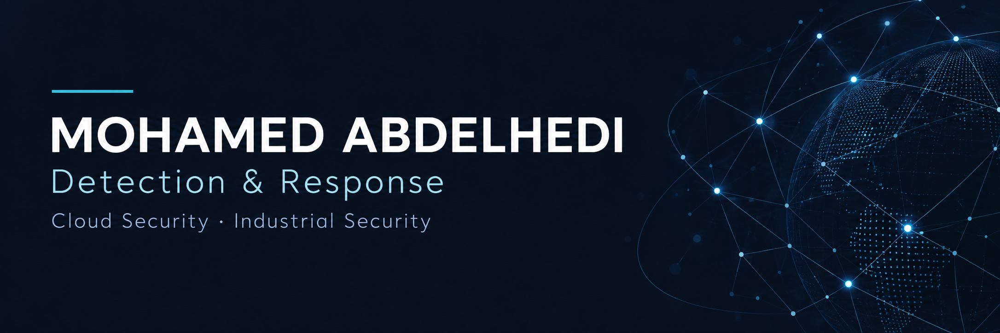

# Mohamed Abdelhedi

**Cybersecurity Analyst (SOC/NOC) · Figeac Aero · Tunis, Tunisia**

I work across security operations, threat detection and response, and OT/industrial security, with a focus on Microsoft Sentinel, endpoint security, and Azure/Entra.

[LinkedIn](https://www.linkedin.com/in/med-abdelhedi/) · [Explore my repositories](https://github.com/mohamed-abdelhedi?tab=repositories)

## Featured projects

Selected work from my software development background, spanning web applications, mobile experiences, and machine learning integration.

### [ADAS Validation Resource Manager](https://github.com/mohamed-abdelhedi/ADAS_VRM_primatec)

An Angular and Spring Boot application for managing validation teams, skills, project assignments, and workloads.

**Angular · Java · Spring Boot · MySQL**

[Architecture & setup](https://github.com/mohamed-abdelhedi/ADAS_VRM_primatec#architecture)

### [MusicApp](https://github.com/mohamed-abdelhedi/musicapp)

A Flutter music application with online and local playback, playlist browsing, and a Flask service for audio genre classification. A collaborative prototype with documented contributors.

**Flutter · Firebase · Python · Flask**

[Preview & setup](https://github.com/mohamed-abdelhedi/musicapp#preview)

### [Car Mate](https://github.com/mohamed-abdelhedi/RealTime-Car-Sharing-app)

A Flutter car-sharing prototype with driver and passenger flows, map-based location selection, and Firebase integration.

**Flutter · Firebase · Google Maps**

[Project walkthrough](https://github.com/mohamed-abdelhedi/RealTime-Car-Sharing-app#project-walkthrough)

## Core skills

| Focus | Tools |
| :--- | :--- |
| Detection & response | Microsoft Sentinel, CrowdStrike, Wazuh |
| Network & identity | Fortinet SD-WAN, Cisco ISE, Microsoft Entra, Azure |
| Automation & systems | Python, Linux, Git |
| Security testing | Kali Linux, Burp Suite |

## Education & certifications

**MEng in Telecommunications** · SUP'COM

CISSP (Associate of ISC²) · SSCP · CC · AZ-500

Currently working toward **CCSP**.

## Connect

Find me on [LinkedIn](https://www.linkedin.com/in/med-abdelhedi/) to connect about security operations, cloud security, and industrial environments.
